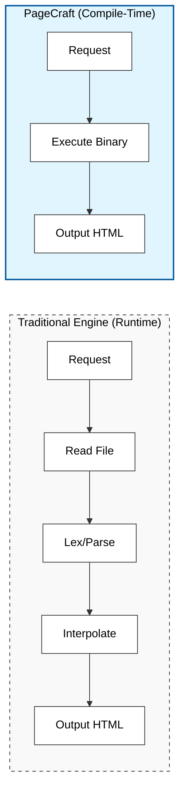
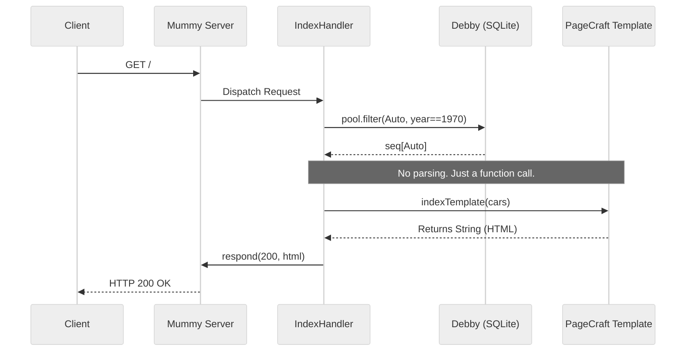

# ✧ PageCraft ✧

> Sick of templating engines treating you like a toddler who might stick a fork in an electrical socket? 
> Well, here’s a fork. ʕ⊙ᴥ⊙ʔ

### A Zero-Runtime HTML Compiler for Nim.

PageCraft is a high-performance/ergonomic DSL for generating dynamic HTML. Unlike traditional templating engines that parse strings at runtime, PageCraft uses Nim macros to compile your HTML directly into optimized string-concatenation procedures.

### Why PageCraft?

This library was born out of frustration with existing web frameworks running on constrained hardware (like the Raspberry Pi Zero W). Most engines burn CPU cycles parsing templates on every request. PageCraft shifts that cost to compile-time.



🚀 Zero Runtime Overhead: No lexers, no parsers, no interpreters running on your server. Just raw speed.

🛡️ Type Safety: If your template tries to print a variable that doesn't exist, your code won't compile.

🧠 Seamless Logic: Use standard Nim if, case, and for loops directly inside your HTML.

🔒 Auditable: ~300 lines of transparent, macro-based code.

### Install

Run `nimble install` inside the directory you extract this repository into or run:

`nimble install https://github.com/RattleyCooper/PageCraft`

### Usage

Define a `proc`, tag it with `{.htmlTemplate.}`, then you can generate HTML using `pagecraft` syntax within that procedure and it will return a string containing the HTML.

### Basic Syntax
* Tags: Use tag: blocks (e.g., `div:`, `p:`). Use identifiers alone for self-closing tags (e.g., `br`).

* Attributes: Standard Nim syntax (e.g., `html lang="en":`).

* Interpolation: Use `{}` to inject variables (e.g., `p: {myVar}`).

* Reserved Keywords: Use backticks for reserved Nim keywords like `div`.

* ⚠️ Escaping: NO auto-escaping, we're all adults. Use `escapeHtml` or the `?` prefix operator provided by pagecraft or bring your own.

```nim
{"Hello, " & ?userGeneratedName} # escapes `userGeneratedName`
```

* PageCraft automatically converts underscores (`_`) in attribute names to hyphens (`-`) to support modern HTML standards like data attributes. `data_id="12"` in pagecraft becomes `data-id="12"` in generated HTML.

```nim
# Nim Input
`div` class="card", data_id="12":
  ...

# HTML Output
<div class="card" data-id="12">
```

### Advanced Features
1. The nimcode Block
If you want to run pure Nim code without the macro evaluating it as HTML, use nimcode:

```Nim
nimcode:
  var timestamp = "12:00 PM"
  echo "Generating timestamp..."
p: {timestamp}
```

2. Alignment with `alignTemplate`
For perfect HTML indentation (useful for debugging), use `alignTemplate`. This is a compile-time feature that injects exact whitespace:

```Nim
proc myComponent() {.alignTemplate: 4.} =
  p: "I am indented by 4 spaces"
```

PageCraft is tag-agnostic and will not create closing tags if there is no content. For example, `script src="/webui.js"` will NOT create a closing `</script>` tag because there is no content defined. You can add an empty string as content(`script src="/webui.js": ""`), or add `/script` on the next line to force the creation of a closing tag for you. This is shown in the example below.

### Examples

#### 1. Standard Usage

 ```nim
import pagecraft, strutils

proc myTemplate(title: string, content: string) {.htmlTemplate.} =
  "<!DOCTYPE html>"
  html lang="en":
    head:
      title: {title}
    body:
      h1: {title.toUpper()}
      
      # Native Nim Control Flow
      if content.len == 0:
        p: "No content provided."
      else:
        `div` class="content":
           # Interpolation
           # `content` is escaped
           p: {?content} 
      
      # Static assets
      script src="/app.js"
      /script # Force closing tag

echo myTemplate("Hello World", "This is PageCraft.")
 ```

#### 2. "The Full Stack" (Mummy + Debby + PageCraft)
PageCraft is designed to work seamlessly with the Mummy HTTP server and Debby ORM. This stack runs incredibly fast on low-power devices.



```nim
import mummy, mummy/routers
import debby/[pools, sqlite]
import pagecraft
import strutils

# Use debby pools with mummy to be safe
let pool = newPool()
for i in 0 ..< 10:
  pool.add openDatabase("site.db")

# DB Model
type Auto = ref object
  id: int
  make: string
  model: string
  year: int

# Migrate
pool.dropTableIfExists(Auto)
pool.createTable(Auto)
var theAuto1 = Auto(
  make: "Chevrolet",
  model: "Camaro Z28",
  year: 1970
)
var theAuto2 = Auto(
  make: "Dodge",
  model: "Challenger",
  year: 1970
)
pool.insert(theAuto1)
pool.insert(theAuto2)

# Tiny stylesheet for sanity
const style = """body { font-family: Arial, sans-serif; margin: 0; padding: 0; background-color: #f4f4f4; }
section { padding: 20px; }
div { margin-bottom: 10px; padding: 10px; background-color: #ffffff; border: 1px solid #dddddd; border-radius: 4px; }"""

# Align the template stubs using `alignTemplate`
proc carCard(car: Auto) {.alignTemplate: 8.} =
  `div` class="auto-div", id={$car.id}:
    # car.make and car.model are escaped with `?` prefix operator.
    p: {"Make: " & ?car.make}
    p: {"Model: " & ?car.model}
    p: {"Year: " & $car.year}

proc carsSection(cars: seq[Auto]) {.alignTemplate: 2.} =
  # Main Autos section
  section:
    h2: 
      "Check out my cars!"
    `div`:
      # ~~~ Insert a new car card for each new car
      section class="auto-section":
        for car in cars:
          {carCard(car)}

# Generate our dynamic HTML
proc indexTemplate(cars: seq[Auto]) {.htmlTemplate.} =
  # Define our site.
  "<!DOCTYPE html>"
  html lang="en":
    head:
      title: "Some Site"
      style: {style} # Style for sanity
      
    body:
      h1: "Welcome to my car website!"
      # Only display cars section if we have
      # cars to show.
      if cars.len > 0:
        {carsSection(cars)}
      else:
        p: "No cars :("

proc indexHandler(request: Request) =
  var headers: HttpHeaders
  headers["Content-Type"] = "text/html"

  var cars = pool.filter(Auto, it.year == 1970)
  request.respond(200, headers, indexTemplate(cars))

var router: Router
router.get("/", indexHandler)

let server = newServer(router)
echo "Serving on http://localhost:8080"
server.serve(Port(8080))
```

Credits: 
Expands on the metaprogramming concepts introduced at [HookRace](https://hookrace.net/blog/introduction-to-metaprogramming-in-nim/).
